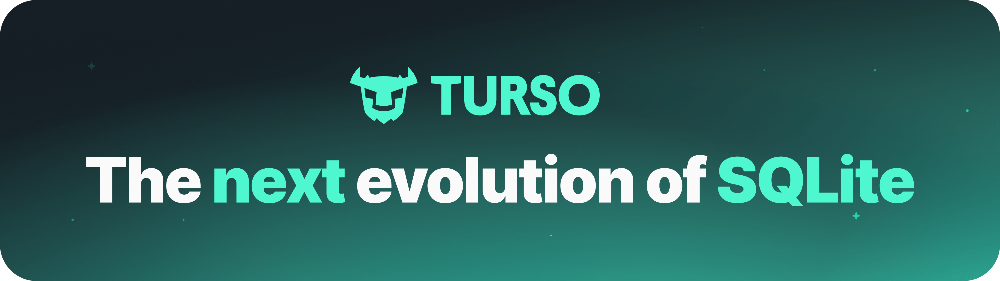

  <a href="https://docs.turso.tech/sdk/ts/quickstart">
    
    <h1 align="center">Turso</h1>
  </a>

  Turso is a SQLite-compatible database built on <a href="https://turso.tech/libsql">libSQL</a>, the Open Contribution fork of SQLite. It enables scaling to hundreds of thousands of databases per organization and supports replication to any location, including your own servers, for microsecond-latency access.

  <a href="https://docs.turso.tech/quickstart"><strong>Quickstart</strong></a> ·
  <a href="https://docs.turso.tech"><strong>Docs</strong></a> ·
  <a href="https://github.com/tursodatabase/examples"><strong>Examples</strong></a> ·
  <a href="https://dub.sh/turso-gh-discord"><strong>Discord</strong></a> ·
  <a href="https://blog.turso.tech/"><strong>Blog &amp; Tutorials</strong></a>

## Hey 👋 

If you're new to Turso, you can get started following our [Quickstart Guide](https://docs.turso.tech/quickstart) where you will learn how to create, connect, and replicate a database.

### Turso

Turso is a fully managed database platform that you can use to create thousands of SQLite-compatible databases.

- [Turso CLI](https://docs.turso.tech/cli/introduction) &mdash; Manage groups, databases, and API tokens with the Turso CLI.
- [Turso Platform API](https://docs.turso.tech/api-reference/introduction) &mdash; Programmatically manage groups and databases using the Platform API.

### libSQL

The libSQL database, [server (`sqld`)](https://github.com/tursodatabase/libsql/tree/main/libsql-server), and client SDKs are all open source. You can build and run your own libSQL instance, or use the fully managed Turso platform.

- [libSQL](https://github.com/tursodatabase/libsql)
- [TypeScript / JS Client](https://github.com/tursodatabase/libsql-client-ts)
- [Rust Client](https://github.com/tursodatabase/libsql/tree/main/libsql)
- [Go Client](https://github.com/tursodatabase/libsql-client-go)
- [Python Client (experimental)](https://github.com/tursodatabase/libsql-experimental-python)
- [libSQL over HTTP (Hrana)](https://github.com/tursodatabase/libsql/blob/main/docs/HTTP_V2_SPEC.md)

### 💚 Community

Join the Turso community to ask questions, discuss best practices, and share tips on [Discord](https://dub.sh/turso-gh-discord) and [Twitter](https://twitter.com/tursodatabase).
